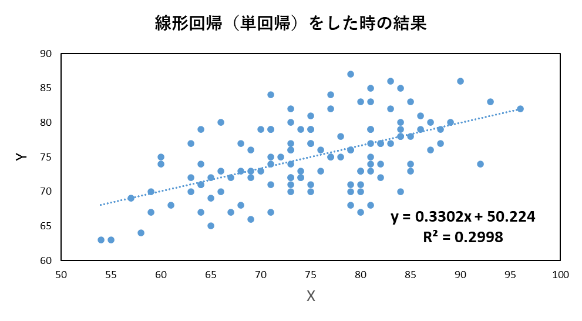
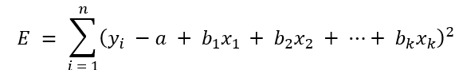
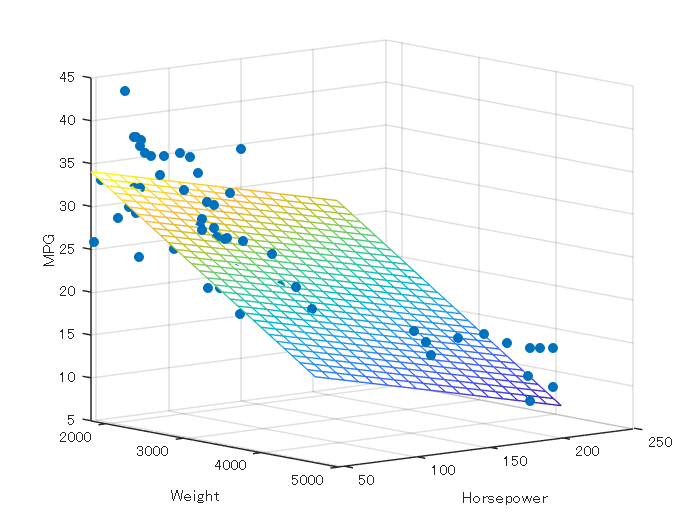

# 重回帰分析の勉強＆実装による検算をしてみよう

この記事は、MATLABアドベントカレンダー（その2）の6日目の記事として書かれています。

https://qiita.com/advent-calendar/2022/matlab

# 1 はじめに

前回の記事では、1つの変数のみで、線形回帰（単回帰）を行うときの、数式の導出や自身の実装による検算を行いました。

**線形回帰（単回帰分析）を1から実装して理解を深めてみよう**

[https://kentapt.hatenablog.com/entry/matlabAdventDay4](https://kentapt.hatenablog.com/entry/matlabAdventDay4)

  

**線形回帰（単回帰分析）を1から実装して理解を深めてみよう: つづき**

[https://kentapt.hatenablog.com/entry/matlabAdventDay5](https://kentapt.hatenablog.com/entry/matlabAdventDay5)

  

そこでは、y = ax + bという非常にシンプルな場合を扱いました。



今回は、

　

といったような、変数の数を増やした場合について考えたいと思います。

  

そこで、本記事では、変数の数を増やして線形回帰（重回帰分析）をしたときの、計算方法について簡単にまとめます。さらに、MATLABを用いてコーディングをし、ここでの理解による実装の結果と、MATLABのregress関数の結果が一致することを確かめます。本記事は、タイプミスや間違いなどがあるかもしれません。その場合教えていただけますと幸いです。また、本記事は、前回の記事をもとに、執筆をしており、説明が比較的少なくなっています。もしよろしければ、先述した前回の記事も見ていただけますと幸いです。

また、本記事の原稿や用いたコードは以下のページにアップロードされています。

[https://github.com/KentaItakura/blog-post-about-multi-regression-model](https://github.com/KentaItakura/blog-post-about-multi-regression-model)

本記事の執筆においては、以下の資料が非常に参考になりました。

http://fs1.law.keio.ac.jp/\textasciitilde{}aso/ecnm/pp/reg2.pdf

  
# 2 重回帰分析について

重回帰モデル (multiple regression model) とは、単回帰とは異なり、説明変数が複数ある回帰モデルのことです。

モデル式は、線形回帰に変数をさらに加えて以下のようになります。


...(1)

単回帰のときと同様に、誤差を2乗して、足したもの（残差平方和）を求めます。



...(2)

前回の記事と同様に、各変数で偏微分を行います。


のようにおいて、合成関数の微分を行っています。

aおよびに対して、偏微分を行った時の式を以下に記述します。


...(3)

yを左辺に移動させて、両辺を-2で割り、整理すると以下のようになります。

この式を正規方程式（`normal equation`）と呼びます。


...(4)

  

なお，変数の数が1つの単回帰の場合については，(4)の最初の方程式を他の方程式に代入することで、連立方程式を解くことができました。しかし、変数が多くなると、このように解析に解くことは非常に困難です。そこで行列を用いて解いていきます。

(4)の左辺を行列式で表すと以下のようになります。

  


...(5)

なお、 はi番目のサンプルのyの値を示し、 は、k番目の変数のl番目の値を示しています。

また、


と置いています。

さらに、(4)の右辺を行列式で表します。


...(6)

(6)のようにきれいな形で表すことができました。

さらに、(6)の式をXを用いて表すと、以下のようになります。


...(7)

(4)の左辺は(5)で、(4)の右辺は(6)のようになりました。

そこで、それらを合わせて、


...(8)

となります。

の逆行列が存在すれば、


..(9)

となり、係数の値（最小二乗推定量）を得ることができました。

# 3 回帰直線がサンプルの平均を通ることの確認 

単回帰分析の記事で、回帰直線がサンプルの平均を通ることを示しました。

[https://kentapt.hatenablog.com/entry/matlabAdventDay4](https://kentapt.hatenablog.com/entry/matlabAdventDay4)

重回帰分析でも同様です。

(4)の1つ目の式で以下のことが示されていました。


この式をサンプル数nで割ると、以下の式を得ることができます。


...(10)

なお、yの平均を、xの平均をとしています。

この式から、回帰直線は、必ずサンプルの平均（重心）点を通ることがわかります。

また、単回帰分析の場合と同様に、残差の和は０であることや、残差ベクトルとが説明変数xは直交することも導くことができます。

# 4 重回帰分析を自分で実装して検算してみよう

3章まででまとめた重回帰分析に対する理解が正しいことを確認するために、4章では、自分で重回帰分析を実装します。まずは、MATLABを用いて計算し、さらに自分の手で実装します。そして、それらの結果が一致することを確認します。

## 4.1. MATLABのfitlm関数による計算

はじめに、MATLABの関数を用いて、重回帰分析を計算します。`carsmall`データをロードし、さらに、`fitlm`関数を利用します。

```matlab:Code
load carsmall
X = [Weight,Horsepower,Acceleration];
% fitlm を使用して、線形回帰モデルを当てはめます。
mdl = fitlm(X,MPG)
```

```text:Output
mdl = 
線形回帰モデル: 
    y ~ 1 + x1 + x2 + x3

推定された係数: 
                    Estimate        SE          tStat        pValue  
                   __________    _________    _________    __________

    (Intercept)        47.977       3.8785        12.37    4.8957e-21
    x1             -0.0065416    0.0011274      -5.8023    9.8742e-08
    x2              -0.042943     0.024313      -1.7663       0.08078
    x3              -0.011583      0.19333    -0.059913       0.95236

観測数: 93、誤差の自由度: 89
平方根平均二乗誤差: 4.09
決定係数: 0.752、自由度調整済み決定係数: 0.744
F 統計量 - 定数モデルとの比較: 90、p 値は 7.38e-27 です
```

このように、切片47.977、および、各変数の係数を得ることができました。

## 4.2. 自分の手で実装してみる

Xは以下のように定義されました。


縦に、サンプル、横に変数が並んでいて、データセットと同じ形をしています。そのため、

一番左の列に1を足すだけでよく、以下のようにするとXを定義できます。

```matlab:Code
validIdx = ~isnan(MPG)&~isnan(X(:,2));
X = X(validIdx,:);
MPG = MPG(validIdx);
myX = [ones(size(X,1),1),X];
```

さらに、重回帰分析の式は以下のように解くことができることがわかりました。


さきほどのXと合わせて、以下のように計算できます。

```matlab:Code
b = inv(myX'*myX)*myX'*MPG
```

```text:Output
b = 4x1    
   47.9768
   -0.0065
   -0.0429
   -0.0116

```

すると、4.1と同じ結果を得ることができました。

## 4.3. 重回帰分析を3次元プロットする

4.2では3変数を利用しましたが、次は、2変数のみを利用し、その結果を3次元プロットします。

以下のページを参考にしています。

https://jp.mathworks.com/help/stats/regress.html

```matlab:Code
load carsmall
x1 = Weight;
x2 = Horsepower;    % Contains NaN data
y = MPG;
% 
X = [ones(size(x1)) x1 x2];
b = regress(y,X) 
```

```text:Output
b = 3x1    
   47.7694
   -0.0066
   -0.0420

```

```matlab:Code
scatter3(x1,x2,y,'filled')
hold on
x1fit = min(x1):100:max(x1);
x2fit = min(x2):10:max(x2);
[X1FIT,X2FIT] = meshgrid(x1fit,x2fit);
YFIT = b(1) + b(2)*X1FIT + b(3)*X2FIT;
mesh(X1FIT,X2FIT,YFIT)
xlabel('Weight')
ylabel('Horsepower')
zlabel('MPG')
view(50,10)
hold off
```



上の図のように、説明変数をx、y軸とし、目的変数をz軸としてプロットすることができました。

# 5 まとめ

本記事では、重回帰分析について簡単にまとめました。行列式を用いることで、単回帰と同じ流れで簡単に導出することができました。さらに、MATLABでも実装し、自身の理解が正しいことを確認できました。

今回は、具体的な利用については述べませんでした。重回帰分析は様々な変数を入れることができるため、便利です。しかし多重共線性などについても考慮しながら、うまく運用することが重要です。今後も引き続き勉強し、うまくこのようなモデルを扱えるようになりたいです。

[https://sorb.co.jp/blog/1742/](https://sorb.co.jp/blog/1742/)

  
# 参考文献（本文中に記載のないもの）

**Albertさま データ分析基礎知識サイト**

[https://www.albert2005.co.jp/knowledge/statistics_analysis/multivariate_analysis/multiple_regression](https://www.albert2005.co.jp/knowledge/statistics_analysis/multivariate_analysis/multiple_regression)

***丹羽時彦さま 放課後の数学入門***

[https://www.kwansei.ac.jp/hs/z90010/sugakuc/toukei/rp9/rp9.htm](https://www.kwansei.ac.jp/hs/z90010/sugakuc/toukei/rp9/rp9.htm)

**MATLABドキュメンテーション fitlm**

[https://jp.mathworks.com/help/stats/fitlm.html](https://jp.mathworks.com/help/stats/fitlm.html)
